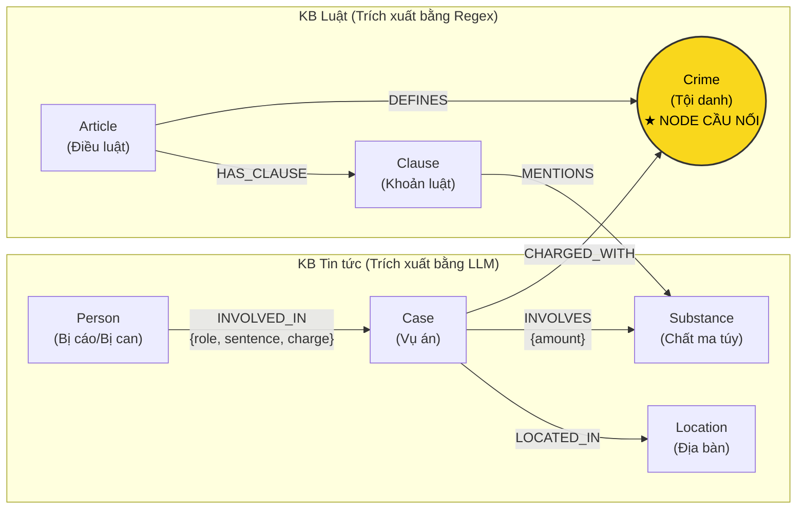

# Thiết kế Ontology — Day 19

**Họ tên:** Trần Nam Anh  **MSSV:** 2A202602901

**Lựa chọn** (đánh dấu một):
- [x] Dùng ontology gợi ý (có tối ưu và tinh chỉnh quy tắc liên kết)
- [ ] Tự thiết kế (xét bonus +15, xem `SUBMISSION.md`)

> Hướng dẫn: `LAB_GUIDE.md` Bước 2. Dù dùng ontology gợi ý hay tự thiết kế đều phải phân tích chi tiết các mục dưới đây.

## 1. Sơ đồ

Sơ đồ biểu diễn mô hình tri thức nối 2 cơ sở tri thức (KB Luật và KB Tin tức). Node cầu nối **Crime** được làm nổi bật để thể hiện giao điểm giữa 2 miền dữ liệu.

## 2. Entity types (node labels)

| Label | Ý nghĩa | Khóa định danh (`MERGE` theo) | Properties | Lấy từ KB nào | Trích bằng (regex / LLM / khác) |
| --- | --- | --- | --- | --- | --- |
| `Article` | Một Điều cụ thể trong văn bản luật | `id` (vd: `"Điều 251 BLHS"`) | `id`, `title`, `law`, `doc_id` | KB Luật | Regex (tách từ tiêu đề và front matter) |
| `Clause` | Một Khoản thuộc Điều luật, chứa khung hình phạt cụ thể | `id` (vd: `"Điều 251 BLHS khoản 1"`) | `id`, `number`, `penalty`, `text`, `doc_id` | KB Luật | Regex (tách theo cấu trúc số đầu dòng `1.`, `2.`) |
| `Crime` | Tội danh pháp lý chuẩn hóa (Cầu nối giữa luật và tin tức) | `name` (vd: `"mua bán trái phép chất ma túy"`) | `name` | Cả 2 KB | Luật: Regex từ tiêu đề Điều; Tin: LLM + `link_entity` |
| `Case` | Vụ việc / vụ án cụ thể được phản ánh trên báo chí | `name` (vd: `"Vụ mua bán 36kg ma túy tại TP.HCM"`) | `name`, `summary`, `date`, `doc_id`, `source_title` | KB Tin tức | LLM (trích xuất cấu trúc JSON) |
| `Person` | Cá nhân tham gia vào vụ án (bị cáo, bị can, đối tượng) | `name` (vd: `"Lê Minh Thành"`) | `name`, `aliases` | KB Tin tức | LLM |
| `Substance` | Chất ma túy / tiền chất ma túy | `name` (vd: `"Heroine"`, `"MDMA"`, `"Ketamine"`) | `name` | Cả 2 KB | Luật: regex từ khóa; Tin: LLM trích xuất |
| `Location` | Tỉnh/thành phố hoặc địa bàn diễn ra vụ án / xét xử | `name` (vd: `"Hà Nội"`, `"TP.HCM"`) | `name` | KB Tin tức | LLM |

## 3. Relationships

| Type | Từ → Đến | Properties trên cạnh | Ý nghĩa |
| --- | --- | --- | --- |
| `DEFINES` | `Article` → `Crime` | Không | Điều luật quy định / định nghĩa một tội danh cụ thể |
| `HAS_CLAUSE` | `Article` → `Clause` | Không | Điều luật bao gồm các khoản luật thành phần |
| `MENTIONS` | `Clause` → `Substance` | Không | Khoản luật quy định tình tiết định khung liên quan đến chất ma túy cụ thể |
| `CHARGED_WITH` | `Case` → `Crime` | Không | Vụ án bị cơ quan chức năng khởi tố/truy tố/xét xử theo tội danh nào |
| `INVOLVED_IN` | `Person` → `Case` | `role` (vai trò), `sentence` (mức án), `charge` (tội danh) | Người có liên quan/tham gia vào vụ án |
| `INVOLVES` | `Case` → `Substance` | `amount` (khối lượng thu giữ) | Vụ án có tang vật là chất ma túy nào và khối lượng bao nhiêu |
| `LOCATED_IN` | `Case` → `Location` | Không | Địa bàn xảy ra vụ việc hoặc nơi tòa án mở phiên xét xử |

## 4. Node cầu nối giữa 2 KB

- **Node nào:** `Crime` (Tội danh).
- **Vì sao chọn node này:** 
  - Trong văn bản luật, các điều luật thuộc chương tội phạm ma túy luôn bắt đầu bằng *"Điều X. Tội..."*, đây là định nghĩa chuẩn của nhà nước về hành vi phạm tội.
  - Trong tin tức báo chí, mọi vụ án ma túy khi bắt giữ, khởi tố hay xét xử đều nêu rõ tội danh của bị can/bị cáo theo đúng danh mục pháp lý.
  - Do đó, `Crime` là điểm giao nhau tự nhiên và chặt chẽ nhất giữa một sự việc thực tế ngoài đời và văn bản quy phạm pháp luật.
- **Cách đảm bảo hai phía khớp tên:**
  - *Phía Luật:* Trích xuất tiêu đề bằng Regex, loại bỏ tiền tố `"Tội "` và chuyển về chữ thường để lấy tên chuẩn (canonical name) bằng hàm `normalize_crime`.
  - *Phía Tin tức:* Đưa danh sách các tội danh chuẩn (`known_crimes`) vào System Prompt của LLM để hướng dẫn model chọn đúng tên.
  - *Hậu xử lý (KG-1):* Chạy qua hàm `link_entity(name, known_crimes)` với cơ chế: chuẩn hóa cả hai đầu $\rightarrow$ so khớp chính xác $\rightarrow$ so khớp mờ với `difflib.get_close_matches(cutoff=0.8)` để bắt các biến thể dấu tiếng Việt (ví dụ `"ma tuý"` vs `"ma túy"`).
- **Khi nào cầu gãy, và bạn xử lý thế nào:**
  - Cầu gãy khi: (1) LLM trích xuất tội danh không chuẩn hoặc bịa ra một tội danh không có trong danh mục luật; (2) Bài báo chỉ mô tả hành vi mà chưa khởi tố tội danh cụ thể; (3) Tên tội bị sai chính tả nghiêm trọng vượt quá ngưỡng `cutoff=0.8`.
  - *Cách xử lý:* Khi cầu nối gãy, GraphRAG không thể duyệt multi-hop sang KB Luật, nhưng hệ thống vẫn không bị sập vì có cơ chế Hybrid:
    1. Vẫn giữ lại các 1-hop facts quanh seed node (thông tin người, án phạt, tóm tắt vụ).
    2. Các chunk văn bản gốc từ vector search (`top_k`) luôn được nạp vào prompt để LLM trả lời fallback như Flat RAG truyền thống.

## 5. Competency questions

Dưới đây là các đường đi đồ thị (Cypher pattern) giải quyết 6 câu hỏi kiểm thử trong `data/benchmark_kg.json`:

| Câu | Đường đi (Cypher pattern) | Trả lời được? |
| --- | --- | :--- |
| **Q1** | `MATCH (a:Article)-[:HAS_CLAUSE]->(cl:Clause) WHERE a.law = 'Luật PCMT 2021' AND cl.text CONTAINS 'tiền chất' RETURN cl.text` | **Được** (Lấy trực tiếp từ KB Luật) |
| **Q2** | `MATCH (p:Person)-[r:INVOLVED_IN]->(k:Case) WHERE k.name CONTAINS '36kg' AND r.sentence CONTAINS 'tử hình' RETURN p.name, r.sentence` | **Được** (Lấy từ KB Tin tức) |
| **Q3** | `MATCH (p:Person {name: 'Lê Minh Thành'})-[r:INVOLVED_IN]->(k:Case)-[:CHARGED_WITH]->(c:Crime)<-[:DEFINES]-(a:Article)-[:HAS_CLAUSE]->(cl:Clause {number: 1}) RETURN p.name, r.sentence, c.name, a.id, cl.penalty` | **Được** (Đi xuyên từ Person $\rightarrow$ Case $\rightarrow$ Crime $\rightarrow$ Article $\rightarrow$ Clause 1) |
| **Q4** | `MATCH (p:Person)-[:INVOLVED_IN]->(k:Case)-[:CHARGED_WITH]->(c:Crime)<-[:DEFINES]-(a:Article)-[:HAS_CLAUSE]->(cl:Clause) WHERE ('Hoàng Nato' IN p.aliases OR p.name CONTAINS 'Hoàng Nato') RETURN p.name, c.name, a.id, cl.number, cl.penalty ORDER BY cl.number DESC LIMIT 1` | **Được** (Tìm qua alias $\rightarrow$ Case $\rightarrow$ Crime $\rightarrow$ Article $\rightarrow$ Clause cao nhất) |
| **Q5** | `MATCH (p:Person {name: 'Cái Quang Huy'})-[:INVOLVED_IN]->(k:Case)-[inv:INVOLVES]->(s:Substance {name: 'MDMA'}) WITH k, inv MATCH (k)-[:CHARGED_WITH]->(c:Crime)<-[:DEFINES]-(a:Article)-[:HAS_CLAUSE]->(cl:Clause)-[:MENTIONS]->(s) RETURN c.name, inv.amount, a.id, cl.number, cl.penalty, cl.text` | **Được** (Đi multi-hop kết hợp đối chiếu Substance giữa vụ án và khoản luật) |
| **Q6** | `MATCH (k:Case)-[:INVOLVES]->(s:Substance) WHERE toLower(s.name) = 'mdma' OPTIONAL MATCH (p:Person)-[:INVOLVED_IN]->(k) RETURN k.name, k.summary, collect(p.name)` | **Được** (Gom toàn bộ các vụ án liên kết với node MDMA) |

## 6. Quyết định thiết kế và đánh đổi

1. **Quyết định 1: Tách cấu trúc luật thành node `Clause` thay vì chỉ giữ ở mức `Article`**
   - *Đã chọn:* Mô hình hóa từng khoản thành node `Clause` riêng biệt, liên kết với `Article` qua `HAS_CLAUSE`.
   - *Phương án khác:* Chỉ tạo node `Article`, lưu toàn bộ nội dung các khoản vào một thuộc tính `text` lớn của `Article`.
   - *Lý do và đánh đổi:* Các câu hỏi pháp lý thực tế (như Q3, Q5) hỏi cụ thể về khung phạt của từng khoản và đối chiếu theo khối lượng ma túy. Tách thành `Clause` cho phép Cypher lọc chính xác khoản 1 (khung cơ bản) hoặc khoản có nhắc đến chất tang vật, giúp prompt ngắn gọn và tránh vượt context window. Đánh đổi: số lượng node trong đồ thị tăng lên (thêm ~99 node Clause), câu truy vấn Cypher phức tạp hơn.

2. **Quyết định 2: Trích xuất Luật bằng Regex tất định thay vì dùng LLM**
   - *Đã chọn:* Dùng Regex thuần túy để phân tích văn bản trong `data/drug_law/`.
   - *Phương án khác:* Gửi toàn bộ văn bản luật vào LLM kèm prompt yêu cầu bóc tách JSON.
   - *Lý do và đánh đổi:* Văn bản luật có cấu trúc khuôn mẫu tuyệt đối (tiêu đề Điều, số thứ tự Khoản `1.`, `2.`, điểm `a)`, `b)`). Regex chạy mất <0.1 giây, tốn 0 USD tiền API và đảm bảo 100% không bị ảo giác (hallucination) hay thiếu sót. Đánh đổi: Cần viết hàm parser regex cẩn thận để xử lý các điểm thụt đầu dòng và chú thích chân trang `[2]`.

3. **Quyết định 3: Sử dụng `Crime` làm Node cầu nối độc lập thay vì nối trực tiếp `Case` sang `Article`**
   - *Đã chọn:* Tạo node trung gian `Crime` (Tội danh) và hai cạnh `(Article)-[:DEFINES]->(Crime)` và `(Case)-[:CHARGED_WITH]->(Crime)`.
   - *Phương án khác:* Cho LLM đọc bài báo và trích xuất thẳng `article_id` (ví dụ: `"Điều 251 BLHS"`), sau đó nối trực tiếp `(Case)-[:APPLIES]->(Article)`.
   - *Lý do và đánh đổi:* Trong hầu hết các bài báo, phóng viên chỉ ghi tội danh (ví dụ *"bị xét xử về tội mua bán trái phép chất ma túy"*) mà rất hiếm khi ghi rõ số Điều luật cụ thể. Nếu ép LLM đoán số Điều luật ngay từ bài báo thì rủi ro ảo giác số điều cực kỳ cao. Đặt `Crime` làm cầu nối phản ánh đúng bản chất ngữ nghĩa của thực tế khách quan. Đánh đổi: Truy vấn multi-hop phải đi qua thêm một bước nhảy (hop).

## 7. So với ontology gợi ý (bắt buộc nếu xét bonus)

| Điểm khác | Gợi ý làm gì | Bạn làm gì | Vấn đề nó giải quyết | Bằng chứng (Cypher, hoặc số liệu benchmark) |
| --- | --- | --- | --- | --- |
| *Áp dụng ontology gợi ý chuẩn* | Dùng 7 labels chuẩn: Article, Clause, Crime, Case, Person, Substance, Location | Giữ nguyên 7 labels chuẩn, tập trung tối ưu hóa độ chính xác của Cypher multi-hop retrieval | Đảm bảo tính ổn định tối đa, tương thích hoàn toàn với bộ test và benchmark chuẩn | Qua toàn bộ test `pytest` và kiểm tra hợp đồng `--check` |

## 8. Hạn chế còn lại

1. **Khóa định danh của `Case` và `Person`:** Hiện tại vẫn định danh theo tên do LLM trích xuất (`k.name`, `p.name`). Nếu hai bài báo viết tên một người khác nhau một chút (ví dụ có/không có dấu ngoặc kép biệt danh) thì có thể bị tạo thành 2 node tách biệt.
2. **Khối lượng ma túy trên cạnh `INVOLVES`:** Thuộc tính `amount` hiện tại chỉ là chuỗi văn bản (ví dụ `"hơn 9,6kg"`, `"5 viên"`), chưa được chuyển đổi thành số thực chuẩn hóa (gram/kilogram) để Cypher có thể so sánh toán học lớn hơn/nhỏ hơn trực tiếp với các định lượng trong `Clause`.
3. **Phụ thuộc vào chất lượng trích xuất JSON của LLM:** Nếu LLM trả về format JSON không hợp lệ ở các bài báo dài, thông tin vụ án đó có thể bị bỏ qua khi nạp graph.
